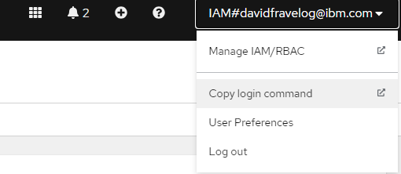
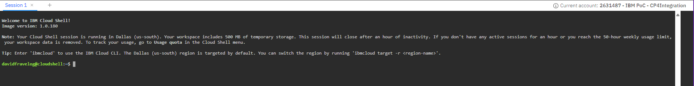
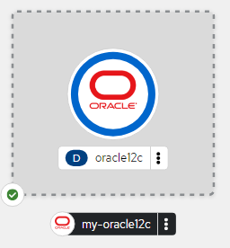
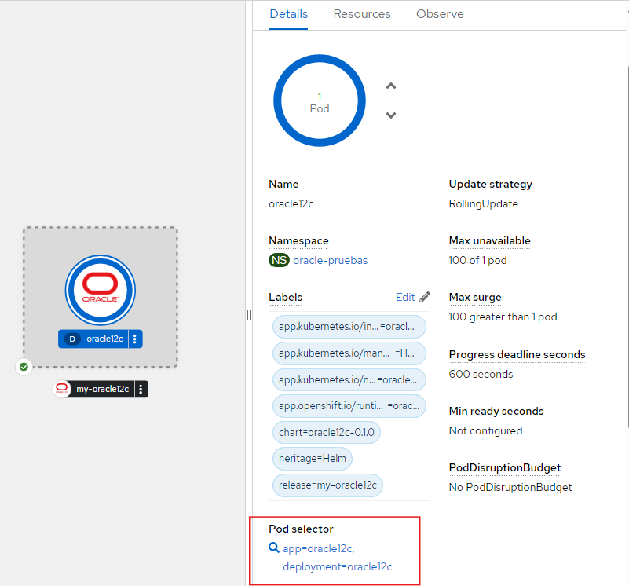
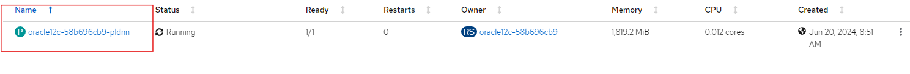
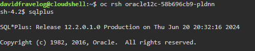

# Base-de-datos-Oracle12c-sobre-OpenShift
Esta es una guia de instalación de una instancia de base de datos Oracle12c sobre Red Hat OpenShift haciendo uso de Helm Chart.
<br/>

## Contenido
1. [Abrir consola de OpenShift](#Abrir-consola-de-OpenShift)
2. [Agregar repositorio e instalar oracle12c](#Agregar-repositorio-e-instalar-oracle12c)
3. [Ejecutar un test de conexion con sqlplus](#Ejecutrar-un-test-de-conexion-con-sqlplus)

# Abrir-consola-de-OpenShift 
En la parte superior derecha abrir el copy login command. 
<div align="center"></div>
Luego, en  la consola de IMB Cloud Shell ingrese el token obtenido para iniciar sesión en su cluster. 
<div align="center"></div>

## Agregar-repositorio-e-instalar-oracle12c
<br/>
Una vez iniciado, se agrega un repositorio de oracle (https://maximilianopizarro.github.io/oracle-helm-charts/) con el siguiente comando:

```helm repo add oracle-helm-charts https://maximilianopizarro.github.io/oracle-helm-charts/```

luego de esto, se instancia con helm install:

```helm install my-oracle12c oracle-helm-charts/oracle12c --version 0.1.0```
<div align="center"></div>

## Ejecutar-un-test-de-conexion-con-sqlplus 
Buscar el nombre del pod donde corre Oracle12c.
<div align="center"></div>
<br/>
Dentro, buscamos el nombre del pod.
<div align="center"></div>
<br/>
Teniendo este nombre, ingresamos al pod desde la consola de OpenShift.

```oc rsh nombre_pod```

<br/>
Probamos la conexión a la base de datos con el comando *sqlplus* dandonos una respuesta como la siguiente: 
<div align="center"></div>


